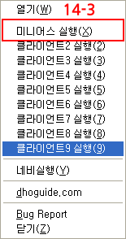

# DHL

대항해시대온라인 자동로그인2.0 소스 (Original DHL2.0 source) - 미니어스

> 해당코드를 사용함에 있어 발생하는 모든 문제는 사용한 당사자에게 있음을 명시합니다.
> Indicate that any problems arising from the use of the code are with the party who used it.

## 만든 배경

    2009년 넷X블의 대항해시대 온라인을 서비스 할 당시만 해도, 다중 클라이언트에 대한 제재가 없었습니다.기본적으로 그당시 유저들은 2~4개의 클라이언트를 실행하여, 따라가기 모드로 물품을 인도로부터 나르고있었습니다.단순하게 로그인,클라이언트 실행 후 로그아웃등의 반복작업이 너무 귀찮았습니다. 그래서 만들게 된것이 대항해시대온라인 자동로그인 프로그램이었습니다.
    2000년대초 게임매크로 서비스를 하면서 아주많은 매크로를 만들고있었던터라 게임프로텍트(잉x프로텍트)등이 없던 대항온은 쉽게 키보드,마우스,화면제어등이 가능했습니다.혼자 쓰다가 남들도 쓰면 좋겠다 싶어 DHGuide 사이트에 공개를 하면서 많은 사람들에게 사랑?을 받았습니다. 유저들의 피드백을 받아 기능을 추가하면서 DHL2.2까지 버전을 올리면서 2~3년의 시간을 보냈던거 같습니다. 그이후 개인적인 사업을 시작하면서 시간이 나지 않았고, 마침 게임내의 다클(다중클라이언트)에 대한 반감이 생기고 있었습니다. 또한 게임운영사에서도 적극 다클을 막기 시작하면서, DHL은 동작하지 않게 되었습니다. 물론 시간을 들여 업데이트를 하면 가능한 상황이었으나, 그만두기로 하고 게임에 관심도 점차 사라졌습니다.

## 소스 오픈배경

    이미 십수년이 지났고, 현재 이소스코드는 동작하지 않습니다. 게임운영사의 로그인 URL과 인자값등이 변경되었고,로그인 검증로직이 변경되었습니다. 하지만 현재도 이부분을 수정하면 사용이 될것으로 생각합니다. 저는 더이상 해당 프로젝트를 업데이트 하지 않을것입니다. 필요한 사람들이 소스를 사용해도 무관합니다. 
    단, 해당코드를 사용함에 있어 발생하는 모든 문제는 사용한 당사자에게 있음을 명시합니다.

## 설치 프로그램

- 언어: 델파이7
- OS: 윈도우7이상
- 사용 패키지
  - ComObj, // IE사용을 위함
  - HTTPApp, //  HTTPEncode ,HTTPDecode
  - INIFiles, // INI 사용을 위함
  - ActiveX, //  TCLSID 사용
  - ShellApi, //Trayicon ADD
  - WinInet, //Cookie 갱신을 위함
  - ExceptionHandler // activex 업데이트용
- 언어타입 : EUC-kr (CP949)

## 매뉴얼

